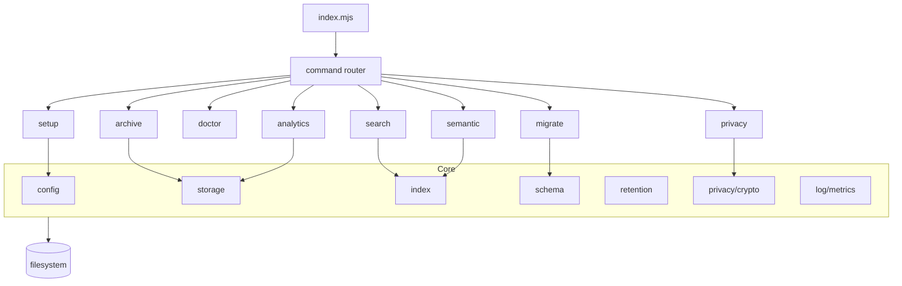
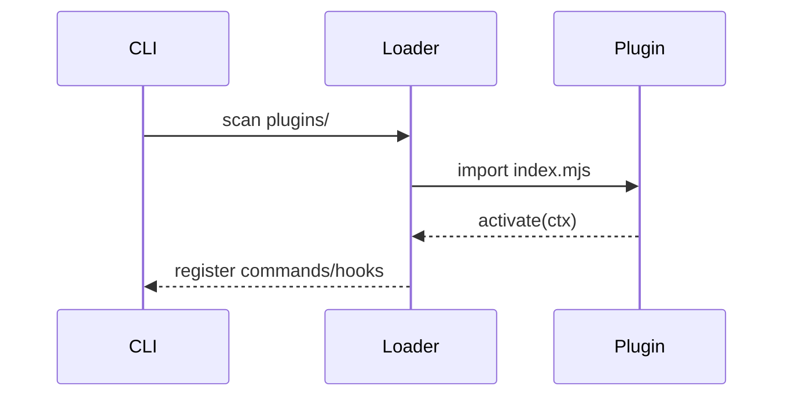

# cursor-memory-cli 项目迭代路线图

> 基于 Codex 深度分析，更新于 2026-02-01

## 项目现状分析

### 定位与核心能力

- **项目定位**：Cursor Memory 系统的安装配置 CLI 工具
- **核心功能**：
  - `setup`：部署 hooks、skills、commands 到全局或项目级别
  - `archive`：手动触发记忆归档，清理过期数据并生成聚合文件

### 代码规模

- **文件数量**：约 24 个文件（排除 assets）
- **代码量**：约 1150 行（.mjs + .sh）
- **技术栈**：Node.js 18+，ESM 模块，零外部依赖

### 当前目录结构速览

```
.
├─ index.mjs
├─ lib/
│  ├─ constants.mjs
│  ├─ copy.mjs
│  ├─ hooks.mjs
│  ├─ logger.mjs
│  ├─ setup.mjs
│  ├─ ui.mjs
├─ templates/
│  ├─ hooks/
│  ├─ skills/
│  ├─ commands/
└─ roadmap/
```

### 架构特点

**优势**
- 纯 Node 内置模块，安装成本低
- hooks 合并具备幂等性
- 归档执行器具备去重、锁机制、隔离区、聚合统计

**潜在问题**
- 缺少测试与验证（无单测/集成测试）
- 配置与兼容性检查不足，错误定位困难
- 可观测性弱，缺少结构化诊断信息
- 记忆查询能力缺失，只有生成/归档，无检索
- 安全性与隐私不足，记忆内容明文存储

### 核心数据流（现状 + 规划）


### 总体技术架构与模块规划（新增）



**模块结构规划（在现有 lib 基础上扩展）**
- `lib/commands/`：命令入口（doctor/search/migrate/analytics/privacy/semantic）
- `lib/core/`：配置、存储、索引、保留策略、schema
- `lib/diagnostics/`：健康检查规则、报告与修复器
- `lib/privacy/`：脱敏与加密
- `lib/semantic/`：语义去重与召回
- `lib/plugins/`：插件加载器、插件 API 适配层

**统一接口约定（示例）**

```js
export function createContext({ cwd, mode, targetDir, logger, now }) {
  return { cwd, mode, targetDir, logger, now };
}

export async function runCommand(ctx, args) {
  // 统一入口模式：解析参数 -> 读取配置 -> 执行业务 -> 输出/退出码
}
```

---

## 创新功能规划

### P0 - 核心基础设施（必须）

#### 1. Memory Doctor（健康检查）

**解决的痛点**
- 安装或运行失败时难以定位问题
- 用户无法自助诊断配置错误

**技术架构设计**
- 诊断引擎：统一执行 `checks` 注册表
- 检查类型：配置合法性、权限、路径、运行时环境、版本兼容
- 报告器：支持文本与 JSON 输出；可选 `--fix` 触发修复器

**模块结构（规划）**
- `lib/commands/doctor.mjs`
- `lib/diagnostics/checks/*.mjs`
- `lib/diagnostics/report.mjs`
- `lib/diagnostics/formatters/{text,json}.mjs`
- `lib/diagnostics/fixers/*.mjs`

**接口设计（示例）**
```js
export async function runDoctor({ targetDir, format = "text", fix = false, strict = false, logger }) {
  const issues = await runChecks({ targetDir, logger });
  return formatReport(issues, { format, strict });
}

export function createCheck({ id, level, run }) {
  return { id, level, run };
}
```

**技术选型权衡**
- 自研诊断引擎 vs 引入依赖：零依赖优先，但需清晰可扩展的 check 规范
- 文本输出 vs JSON 输出：CLI 友好与可脚本化并存，建议默认文本，提供 `--json`

**CLI 交互流程（文字流程）**
1. 用户运行 `cursor-memory doctor --json`
2. CLI 解析参数，定位 `targetDir`
3. 执行诊断检查并收集 `issues`
4. 输出报告；如有 fatal 级问题返回非 0 退出码

**测试策略与质量**
- 单元测试：每个 check 的边界输入与错误处理
- 集成测试：构建临时 `.cursor` fixture（缺失 hooks.json / 权限不足等）

**性能基准与可观测性**
- 基准：常规项目 < 300ms 完成诊断
- 指标：`doctor.checks.total`、`doctor.issues.error`、`doctor.duration_ms`

**风险与技术债**
- false positive 导致误导用户，需允许 `--ignore <checkId>` 白名单

---

#### 2. Memory Search（本地检索）

**解决的痛点**
- 记忆无法快速查找和复用
- 只能手动翻阅 JSON 文件

**技术架构设计**
- 数据源：`memories/archive` 与聚合 `deduped_index`
- 索引策略：默认全量扫描 + 可选倒排索引缓存（增量更新）
- 输出层：JSON / Table

**模块结构（规划）**
- `lib/commands/search.mjs`
- `lib/search/index.mjs`
- `lib/search/query.mjs`
- `lib/search/format.mjs`
- `lib/storage/memories.mjs`

**接口设计（示例）**
```js
export function searchMemories({ keyword, since, type, limit, fields, cursor }) {
  // 读索引或全量扫描 -> 过滤 -> 排序 -> 返回结果
}
```

**技术选型权衡**
- 全量扫描：实现简单，性能有限（小规模 OK）
- 倒排索引：构建成本高，但查询快；可通过 `--reindex` 触发更新

**CLI 交互流程（文字流程）**
1. 解析参数 `--since/--type/--keyword/--limit`
2. 判断是否存在索引
3. 查询并输出（`--format table|json`）

**测试策略与质量**
- 单元测试：查询解析、过滤逻辑
- 集成测试：构建 1k/10k fixture 校验性能与排序稳定性

**性能基准与可观测性**
- 基准：10k 记录 < 200ms，索引构建 < 2s
- 指标：`search.index.hit`、`search.result.count`、`search.duration_ms`

**风险与技术债**
- 索引陈旧导致结果错误，需要 `--reindex` 与自动过期策略

---

### P1 - 稳定性与扩展性

#### 3. Schema Validator & Migrator（格式验证与迁移）

**解决的痛点**
- 未来格式升级时兼容性风险高
- 缺少版本管理机制

**技术架构设计**
- Schema Registry：每个版本对应 schema 文件
- Migration Pipeline：逐版本升级（v1 -> v2 -> v3）
- 回滚机制：生成备份副本（`*.bak`）

**模块结构（规划）**
- `lib/commands/migrate.mjs`
- `lib/schema/index.mjs`
- `lib/schema/validators/*.mjs`
- `lib/migrations/v1_to_v2.mjs`

**接口设计（示例）**
```js
export async function migrate({ from, to, dryRun = false }) {
  // validate(from) -> apply migrations -> validate(to) -> write
}
```

**技术选型权衡**
- JSON Schema：标准化强，但需要解析与验证实现
- 手工校验：轻量，但难以维护与复用

**测试策略与质量**
- 单元测试：每个迁移函数的幂等性
- 集成测试：升级后数据结构一致性与回滚恢复

**性能基准与可观测性**
- 基准：1k 配置迁移 < 100ms
- 指标：`migrate.steps`、`migrate.duration_ms`

**风险与技术债**
- 数据丢失风险，必须默认 `--dry-run` 并提示备份

---

#### 4. Smart Retention（智能保留策略）

**解决的痛点**
- 统一 60 天保留不够灵活
- 无法区分重要记忆和临时记忆

**技术架构设计**
- Policy Engine：基于 `type`、`confidence_score`、`tags` 计算保留天数
- 扩展点：支持自定义规则优先级和权重

**模块结构（规划）**
- `lib/retention/policy.mjs`
- `lib/retention/scorer.mjs`

**接口设计（示例）**
```js
export function computeRetention(record, policy) {
  // 根据类型/置信度/标签返回 retentionDays
}
```

**技术选型权衡**
- 规则优先：可解释性高
- 统计学习：效果好但复杂度和依赖增加

**测试策略与质量**
- 单元测试：典型类型/置信度边界值
- 集成测试：与 archive 聚合流程联动

**性能基准与可观测性**
- 基准：单条记录 < 1ms
- 指标：`retention.days.avg`、`retention.policy.hit`

**风险与技术债**
- 规则配置过复杂时可解释性下降，需要默认模板

---

### P2 - 增强体验

#### 5. Analytics Dashboard（统计报表）

**解决的痛点**
- 无法了解记忆系统的质量和价值
- 缺少使用数据反馈

**技术架构设计**
- 聚合器：统计类型分布、去重率、趋势
- 报告器：输出 Markdown/JSON

**模块结构（规划）**
- `lib/commands/analytics.mjs`
- `lib/analytics/aggregate.mjs`
- `lib/analytics/report.mjs`

**接口设计（示例）**
```js
export function generateReport({ period, format }) {
  // aggregate -> format
}
```

**技术选型权衡**
- 即时统计：实现简单
- 增量缓存：输出快但需维护缓存与失效

**测试策略与质量**
- 快照测试：Markdown 结构稳定
- 集成测试：统计指标准确性

**性能基准与可观测性**
- 基准：10k 记录 < 1s
- 指标：`analytics.report.duration_ms`

**风险与技术债**
- 报告格式变动可能影响用户脚本，需 `--format json` 保持稳定

---

#### 6. Privacy Guard（隐私保护）

**解决的痛点**
- 记忆可能包含敏感信息（API key、密码等）
- 明文存储存在泄露风险

**技术架构设计**
- 两级保护：正则脱敏 + 可选加密
- 加密策略：AES-256-GCM + scrypt 派生密钥
- 密钥管理：环境变量 / 交互输入 / keyfile

**模块结构（规划）**
- `lib/commands/privacy.mjs`
- `lib/privacy/redact.mjs`
- `lib/privacy/crypto.mjs`
- `lib/privacy/policies/*.mjs`

**接口设计（示例）**
```js
export function protectRecord(record, policy) {
  const redacted = redact(record, policy);
  return policy.encrypt ? encryptPayload(redacted, policy.key) : redacted;
}
```

**技术选型权衡**
- 脱敏：可检索但安全性有限
- 加密：安全性强但检索受限（需解密）

**测试策略与质量**
- 轮转测试：同一数据可解密恢复
- 正则覆盖：常见凭证与 token 模式

**性能基准与可观测性**
- 基准：单条记录 < 5ms
- 指标：`privacy.encrypt.count`、`privacy.redact.count`

**风险与技术债**
- 密钥丢失不可恢复，需要明确风险提示与备份机制

---

### P3 - 智能化

#### 7. Semantic Dedupe & Recall（语义去重与召回）

**解决的痛点**
- 仅 Jaccard 去重可能漏掉语义重复
- 无法语义相似召回

**技术架构设计**
- Embedding Provider：本地模型或插件式适配
- 相似度引擎：cosine similarity + 阈值
- 缓存：embedding 缓存以降低重复计算

**模块结构（规划）**
- `lib/commands/semantic.mjs`
- `lib/semantic/embedder.mjs`
- `lib/semantic/dedupe.mjs`
- `lib/semantic/cache.mjs`

**接口设计（示例）**
```js
export async function semanticDedupe({ records, embedder, threshold }) {
  // embedding -> similarity -> dedupe -> output
}
```

**技术选型权衡**
- 本地模型：无需联网但体积大
- 远程服务：效果好但引入隐私与成本风险

**测试策略与质量**
- 固定语料集：确保相似度稳定
- 回归测试：避免阈值变化导致去重比例波动

**性能基准与可观测性**
- 基准：1k 记录 embedding < 3s
- 指标：`semantic.embed.duration_ms`、`semantic.dedupe.rate`

**风险与技术债**
- 模型版本变动导致结果漂移，需要版本锁与回放验证

---

## 迭代路线图

### 短期里程碑（1-2 周）

**目标**：建立核心基础设施

- [ ] Memory Doctor（P0）
  - **Subtasks**
    - [ ] 诊断检查注册表与报告格式
    - [ ] 基础检查集（hooks.json、路径、权限、Node 版本）
    - [ ] `--json` 输出与退出码规范
  - **测试与质量**
    - [ ] 单元测试覆盖 80%
    - [ ] Fixtures 覆盖常见错误输入
  - **性能与可观测性**
    - [ ] 诊断耗时 < 300ms
    - [ ] 输出 `doctor.duration_ms` 指标

- [ ] Memory Search（P0）
  - **Subtasks**
    - [ ] 查询解析器与过滤器
    - [ ] 输出格式化（table/json）
    - [ ] 可选索引缓存（JSONL）
  - **测试与质量**
    - [ ] 查询组合覆盖测试
    - [ ] 1k/10k 数据性能回归
  - **性能与可观测性**
    - [ ] 10k 记录 < 200ms
    - [ ] 输出 `search.result.count`

- [ ] Schema Migrator（P1）
  - **Subtasks**
    - [ ] schema 版本字段引入
    - [ ] v1->v2 迁移示例
    - [ ] `--dry-run` 与备份策略
  - **测试与质量**
    - [ ] 迁移幂等性测试
  - **性能与可观测性**
    - [ ] 1k 迁移 < 100ms

**交付物**
- 3 个新命令可用
- 基础测试覆盖
- 文档更新

### 中期里程碑（1-2 月）

**目标**：提升稳定性与体验

- [ ] Smart Retention（P1）
  - **Subtasks**
    - [ ] 策略引擎与默认策略模板
    - [ ] 与 archive 的 retention 逻辑联动
  - **测试与质量**
    - [ ] 规则边界测试
  - **性能与可观测性**
    - [ ] 1k 记录处理 < 1s

- [ ] Analytics Dashboard（P2）
  - **Subtasks**
    - [ ] 聚合统计模块
    - [ ] Markdown/JSON 输出器
  - **测试与质量**
    - [ ] 报表快照测试
  - **性能与可观测性**
    - [ ] 10k 记录报告生成 < 1s

**交付物**
- 智能保留系统上线
- 月度统计报表功能
- 配置文档完善

### 长期里程碑（3-6 月）

**目标**：安全与智能化

- [ ] Privacy Guard（P2）
  - **Subtasks**
    - [ ] 脱敏规则库
    - [ ] AES-256-GCM 加密模块
    - [ ] key 管理与 rotation
  - **测试与质量**
    - [ ] roundtrip 加解密测试
  - **性能与可观测性**
    - [ ] 1k 记录加密 < 2s

- [ ] Semantic Dedupe（P3）
  - **Subtasks**
    - [ ] Embedding Provider 适配层
    - [ ] 相似度引擎与阈值调优
  - **测试与质量**
    - [ ] 固定语料回归
  - **性能与可观测性**
    - [ ] 1k 记录 < 3s

**交付物**
- 隐私保护方案落地
- 智能去重能力提升
- 完整功能测试

---

## 用户体验设计

### CLI 交互流程（按命令）

**setup**
1. 解析 `--global/--local`，无参数时提示选择
2. 合并 hooks.json，拷贝 hook/skill/command
3. 输出摘要与下一步提示

**archive**
1. 解析 `--dry-run/--threshold/--limit`
2. 运行归档 runner（含锁与隔离区）
3. 输出归档统计（处理数、去重数、隔离数）

**doctor**
1. 执行诊断检查
2. 输出错误定位 + 修复建议
3. 提供 `--json` 供脚本集成

**search**
1. 解析过滤条件
2. 选择索引或全量扫描
3. 输出结果与下一步建议（如 `--reindex`）

**migrate**
1. 检测 schema 版本
2. 默认 `--dry-run` 输出变更摘要
3. 应用迁移并备份

**analytics**
1. 选择周期与格式
2. 输出报表与趋势摘要
3. 提示导出路径

**privacy**
1. 选择策略（脱敏/加密）
2. 提示风险与密钥保存建议
3. 输出保护报告

**semantic**
1. 检查 embedding provider
2. 运行语义去重或召回
3. 输出相似度阈值统计

### 错误处理与用户引导

- **错误级别**：info/warn/error/fatal
- **可恢复错误**：提示建议操作与下一步命令
- **不可恢复错误**：返回非 0 退出码，并给出最小可操作建议

### CLI 一致性规范

- 统一 `--help/-h`、`--json`、`--verbose`、`--quiet`、`--no-color`
- 所有命令支持 `--project-root` 与 `--cursor-dir`
- 机器可读输出默认走 `stdout`，人类提示走 `stderr`

---

## 实施建议（补充）

### 测试与质量保证

- 单元测试：`node:test`，模块级覆盖
- 集成测试：真实文件系统 fixture
- 端到端测试：模拟完整 CLI 流程
- 回归测试：性能基线与输出快照对比

### 可观测性与性能基准

- 统一结构化日志（JSON Lines）
- 关键指标：
  - `command.duration_ms`
  - `search.result.count`
  - `archive.files.processed`
  - `privacy.encrypt.count`
- 性能目标：
  - 10k 记录检索 < 200ms
  - 10k 记录归档 < 2s

---

## 风险管理加强

### 技术债务清单

- [ ] CLI 参数解析与错误提示分散
- [ ] 归档逻辑耦合于脚本，不易测试
- [ ] 日志缺少统一结构与可控级别

### 依赖管理与版本升级策略

- 坚持零依赖优先；引入依赖需评估安全与维护成本
- 版本策略：严格 SemVer
- schema 升级必须提供迁移器与回滚机制
- 重要变更需提供 deprecation 期与告警

### 安全与隐私保护实现方案

- 加密算法：AES-256-GCM + scrypt KDF
- 脱敏规则：token、key、email、url 参数
- 密钥管理：环境变量 + keyfile + rotation
- 日志不记录明文敏感内容

---

## 生态系统集成

### 与 Cursor IDE 深度集成

- 自动识别 `.cursor` 与 `~/.cursor`
- 提供 `cursor-memory install --ide` 自动配置 hooks.json
- 在 `commands/` 中注入可用命令模板
- 记录 Cursor 版本与配置兼容性（doctor 中提示）

### 插件扩展机制设计

**插件结构**
```
plugins/
  my-plugin/
    plugin.json
    index.mjs
```

**插件协议（示例）**
```js
export function activate(ctx) {
  ctx.registerCommand("plugin:foo", () => {});
}
```

**加载流程（Mermaid）**


### 社区贡献指南与 API 设计

- 增加 `CONTRIBUTING.md`（issue 模板、PR 流程）
- 提供 `lib/api.mjs` 暴露核心能力（search/archive/migrate）
- 对插件 API 增加版本字段与兼容性校验

---

## 成功指标（细化）

### 短期（1-2 周）
- [ ] Doctor 命令诊断准确率 > 90%
- [ ] Search 命令响应时间 < 100ms（1000 条记忆）

### 中期（1-2 月）
- [ ] 用户满意度 > 4.5/5
- [ ] 配置错误 issues 减少 80%

### 长期（3-6 月）
- [ ] npm 周下载量 > 500
- [ ] GitHub Stars > 100
- [ ] 社区贡献者 > 5

---

## 附录

### 参考实现与最佳实践链接

- https://nodejs.org/api/
- https://nodejs.org/api/test.html
- https://nodejs.org/api/crypto.html
- https://semver.org/
- https://json-schema.org/
- https://cheatsheetseries.owasp.org/cheatsheets/Logging_Cheat_Sheet.html
- https://cheatsheetseries.owasp.org/cheatsheets/Secrets_Management_Cheat_Sheet.html
- https://specifications.freedesktop.org/basedir-spec/basedir-spec-latest.html

### 参考资料

- [Cursor Memory 设计文档](./templates/skills/cursor-memory/SKILL.md)
- [Archive 机制说明](./templates/hooks/cursor-memory-archive.mjs)
- [Memory 类型定义](./templates/skills/cursor-memory/references/TYPES.md)

### 变更历史

| 日期 | 版本 | 变更 |
|-----|------|-----|
| 2026-02-01 | v1.1 | 增强技术深度、实施细节、风险与生态说明 |
| 2026-02-01 | v1.0 | 初始版本，基于 Codex 分析 |
